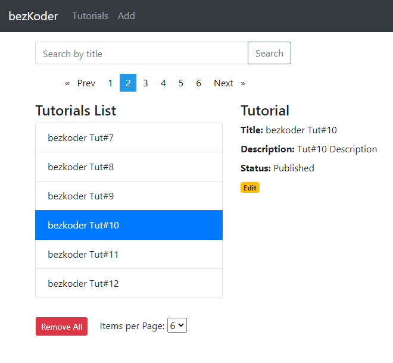

# Angular 17 Pagination example (server side) with ngx-pagination

Angular 17 Pagination example with existing API (server-side pagination) using `ngx-pagination`.

For instruction, please visit:
> [Angular 17 Pagination example with ngx-pagination](https://www.bezkoder.com/angular-17-pagination-ngx/)

Servers will exports API for pagination (with/without filter), here are some url samples:
- `/api/tutorials?page=1&size=5`
- `/api/tutorials?size=5`: using default value for page
- `/api/tutorials?page=1`: using default value for size
- `/api/tutorials?title=data&page=1&size=3`: pagination & filter by title containing ‘data’

Server side Pagination for this app:
> [Node Express Pagination with MySQL](https://www.bezkoder.com/node-js-sequelize-pagination-mysql/)

> [Node Express Pagination with PostgreSQL](https://www.bezkoder.com/node-js-pagination-postgresql/)

> [Node Express Pagination with MongoDB](https://www.bezkoder.com/node-js-mongodb-pagination/)

> [Spring Boot Pagination and Filter example](https://www.bezkoder.com/spring-boot-pagination-filter-jpa-pageable/)

> [Spring Boot MongoDB Pagination example with Spring Data](https://www.bezkoder.com/spring-boot-mongodb-pagination/)

## Run
Run `ng serve --port 8081` for a dev server. Navigate to `http://localhost:8081/`. The app will automatically reload if you change any of the source files.

## More Practice:
> [Angular 17 example: CRUD Application with Rest API](https://www.bezkoder.com/angular-17-crud-example/)

> [Angular 17 JWT Authentication & Authorization with Web API](https://www.bezkoder.com/angular-17-jwt-auth/)

> [Angular 17 File upload example with Progress bar](https://www.bezkoder.com/angular-17-file-upload/)

> [Angular 17 Multiple Files upload example with Progress Bar](https://www.bezkoder.com/angular-17-multiple-file-upload/)

> [Angular 17 Form Validation example (Reactive Forms)](https://www.bezkoder.com/angular-17-form-validation/)

Fullstack with Node:
> [Angular 16 + Node Express + MySQL example](https://www.bezkoder.com/angular-16-node-js-express-mysql/)

> [Angular 16 + Node Express + PostgreSQL example](https://www.bezkoder.com/angular-16-node-js-express-postgresql/)

> [Angular 16 + Node Express + MongoDB example](https://www.bezkoder.com/angular-16-node-js-express-mongodb/)

> [Angular 16 + Node Express: File upload example](https://www.bezkoder.com/angular-16-node-express-file-upload/)

> [Angular 17 + Node.js Express: JWT Authentication and Authorization example](https://www.bezkoder.com/node-js-angular-17-jwt-auth/)

Fullstack with Spring Boot:
> [Angular 16 + Spring Boot example](https://www.bezkoder.com/spring-boot-angular-16-crud/)

> [Angular 16 + Spring Boot + MySQL example](https://www.bezkoder.com/spring-boot-angular-16-mysql/)

> [Angular 16 + Spring Boot + PostgreSQL example](https://www.bezkoder.com/spring-boot-angular-16-postgresql/)

> [Angular 16 + Spring Boot + MongoDB example](https://www.bezkoder.com/spring-boot-angular-16-mongodb/)

> [Angular 16 + Spring Boot: File upload example](https://www.bezkoder.com/angular-16-spring-boot-file-upload/)

> [Angular 17 + Spring Boot: JWT Authentication and Authorization example](https://www.bezkoder.com/angular-17-spring-boot-jwt-auth/)

Fullstack with Django:
> [Angular + Django example](https://www.bezkoder.com/django-angular-13-crud-rest-framework/)

> [Angular + Django + MySQL](https://www.bezkoder.com/django-angular-mysql/)

> [Angular + Django + PostgreSQL](https://www.bezkoder.com/django-angular-postgresql/)

> [Angular + Django + MongoDB](https://www.bezkoder.com/django-angular-mongodb/)

Serverless with Firebase:
> [Angular 17 Firebase CRUD with Realtime DataBase](https://www.bezkoder.com/angular-17-firebase-crud/)

> [Angular 17 Firestore CRUD example](https://www.bezkoder.com/angular-17-firestore-crud/)

> [Angular 17 Firebase Storage: File Upload/Display/Delete example](https://www.bezkoder.com/angular-17-firebase-storage/)

Integration (run back-end & front-end on same server/port)
> [How to integrate Angular with Node Restful Services](https://bezkoder.com/integrate-angular-12-node-js/)

> [How to Integrate Angular with Spring Boot Rest API](https://bezkoder.com/integrate-angular-12-spring-boot/)